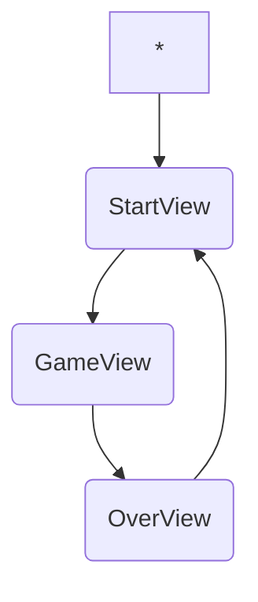

# Project-Chiharu

## 説明
開発研修の一環として、春瑠x遅の共同開発。
中国の中国将棋をVuejsで作成するプロジェクトです。
基本操作はもちろん、その他特別ルールの導入も計画しています。

## 期間
3週間

## ワークフロー
1. プログラム全体構造設計
    1. プログラム全体 - vue-router
    2. Components
    3. 作業分担
2. 機能設計
    1. それぞれのComponentsの機能設計
    2. 拡張性
3. 開発
4. 追加機能の導入

## まずはここから
1. Markdownの基本の書き方
2. Github の使い方・UI or CLI
3. vue-router

## コメントタグの使い方
以下のリストはよく使われているタグ:
1. TODO:
2. FIXME:
3. BUG:
4. HACK:
5. NOTE:
6. WARNING:

## Git Branches
```
- master: Origin
    - chi: 遅さん用
    - test: その他テスト
```


## Git usage
Check current branch
```
git branch
```

Create new branch
```
git checkout -b xxx
```

Switching branch
```
git checkout xxx
```

Delete branch(locally)
```
git branch -d xxx
```

Add, Commit, Push
```
git add .
git commit -m "メッセージはここ"
git push -u origin xxx
```

## 画面git checkout

## Project file tree
```
- root
    - App.vue
    - main.ts
    - src/
        - views/
            - StartView.vue 
            - GameView.vue <- chi
            - OverView.vue
        - components/
            - global/
                - Clock.vue <- chi
                - Header.vue <- chi
            - game/
                - Shogi.vue
                - Graveyard.vue　墓 <- chi
                - GameBoard.vue <- chi
        ...
        - logics/
            - game.ts <- board + game controller : chi
            - game.md <- chi
            - shogi.ts 
            - global.ts
        - types/
            - index.ts
            - shogiType.ts
            - gameType.ts
```

## Dev log
- 2025-06-18
1. ゲーム画面デザイン作成
2. GameController <- Object  
INFO: Game state = processの時だけcallされる
3. GameController.initBoard(players: Player[], board: GameBoard) -> void  
目標 GameBoard のrendering

() => {
    if(!ShogiLocSchema.safeParse(shogi).success){
        console.log("Error: invalid shogi type");
        return;
    }
    console.log("ok");
    return;
}

