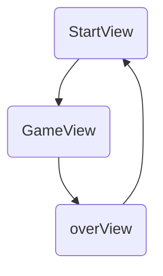

# 中国象棋開発ドキュメント / 中国象棋开发文件
---

## 1. スタート画面 / 开始画面

### 1.1 画面にスタートボタンがあり、クリックするとゲーム画面に遷移する 
 画面上有开始按钮，点击后进入游戏页面

#### routed を利用して画面間の遷移を実装（終了画面も含む）  
通过 routed 实现页面的交互（其中也包括结束画面）

#### ゲーム画面に入った後の画面レイアウトおよび盤面デザイン  
进入画面后的画面设计与棋盘设计

---

## 2.盤面生成ロジック / 棋盘生成逻辑

#### 中国象棋は縦に10行、横に9列のマス目で構成されている。  
中国象棋的棋盘由10行9列组成。

### 2.1 盤面データ構造の定義 / 棋盘数据结构定义

#### 各マスの座標情報を持つ `Dot` 型を定義する。  
定义每一个格子坐标的类型 `Dot`。

```ts
type Dot = {
  x: number; // 列（横轴）/ 横坐标
  y: number; // 行（縦軸）/ 纵坐标
  shogiId: string | null;
};
```
#### 盤面全体は Dot[ ][ ] 型、つまり 2 次元配列として保持する。
整个棋盘是 Dot[][] 类型，即二维数组。

```ts
type GameBoard = Dot[][];
```
#### TypeScriptでは以下のようにして 10×9 の盤面を生成する。
通过以下代码可以创建一个10行9列的棋盘。
```ts
const board : Dot[][] =new Array(10).fill(null).map((_,y)=>(
    new Array(9).fill(null).map((_,x)=>(
        {x,
         y,
         shogiId:null})
)))
```



### 2.2 プレイヤー情報 / 玩家信息
```ts
interface Player {
  id: string;
  name: string;
  color: 'Red' | 'Black';
}
```


### 2.3 ゲームコントローラー /游戏控制器 - 管理整盘游戏的状态和当前轮次

#### 全体のゲーム状態と現在のターンを管理する  


 ```ts
 interface GameController {
  time: string; // 当前时间
  state: 'BeforeStart' | 'Progress' | 'Over';
  playersInControl: {
    Red: PlayerId;
    Black: PlayerId;
  };
  turn: 'Red' | 'Black';
}
 ```
---
## 3. ゲーム画面設計 / 游戏画面设计

### 3.1 駒の移動ロジック / 棋子运动逻辑

#### 3.1.1 駒の種類定義 / 定义棋子的类型

##### 駒の名前の定義  
棋子名称类型

```ts
 type ShogiType = 'che' | 'ma' | 'xiang' | 'shi' | 'jiang' | 'pao' | 'bing' ``
```

##### 駒の位置の型定義  
棋子位置类型
```ts
type ShogiLoc = {
    x: number,
    y: number,
    p: PlayerColor
}
```

##### 駒のテンプレート型定義（静的配置）  
棋子的静态配置类型
```ts
type ShogiTemplate = {
    label:        string,      // 显示标签（中文名）/ 表示名
    shogiType:    ShogiType,   // 类型标识 / 駒タイプ
    loc:          ShogiLoc[],  // 初始坐标数组 / 初期位置
    shogiMoveId:  string,      // 移动逻辑ID / 移動関数のID
    shogiEatId:   string,      // 吃子逻辑ID / 捕獲関数のID
}
```

##### 具体的な駒の定義（馬を例として）  
定义具体的棋子（以马为例）
```ts
type ShogiMap = [K in ShogiType]: ShogiTemplate & { shogiType: K }; 

// 强制每个 key 都是 ShogiType 的一个值，
// 且其对应的 value.shogiType 字段必须与 key 完全一致

const shogiMap: ShogiMap = {
    "ma": {
        label: "馬",
        shogiType: "ma",
        loc: [
            {x: 2, y: 0, p: "Red"},
        ],
        shogiMoveId: "maMove",
        shogiEatId: "maEat",
    }
}
```

#### 3.1.2定义棋子的运动逻辑

##### 駒の実行時の型定義  
棋子运行时的类型
```ts
type Shogi = {
    id: string,               // 唯一 ID
    color: PlayerColor,       // 所属玩家
    type: ShogiType,          // 棋子类型
    move: (shogi: Shogi) => void,  // 移动函数
    eat: (shogi: Shogi) => void    // 吃子函数
}
```
##### 移動／捕獲ロジックの登録  
移动/吃子注册
 ```ts
 const shogiMoveMap = {
    "maMove": {
        id: "maMove",
        f: (shogi: Shogi) => {
            console.log("馬の移動");
        }
    }
}

const shogiEatMap = {
    "maEat": {
        id: "maEat",
        f: (shogi: Shogi) => {
            console.log("馬の捕獲");
        }
    }
}
 ```
